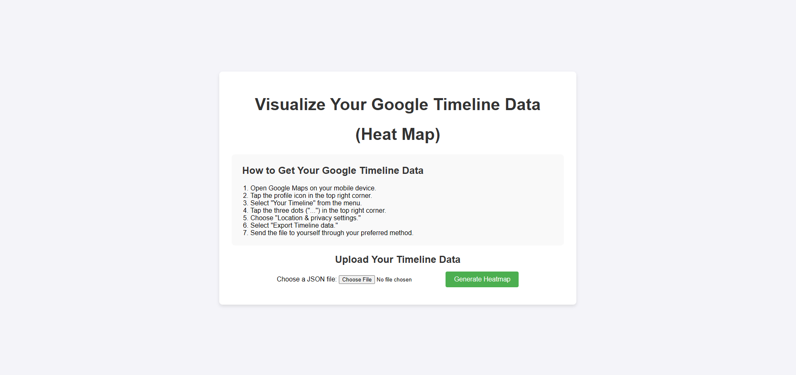
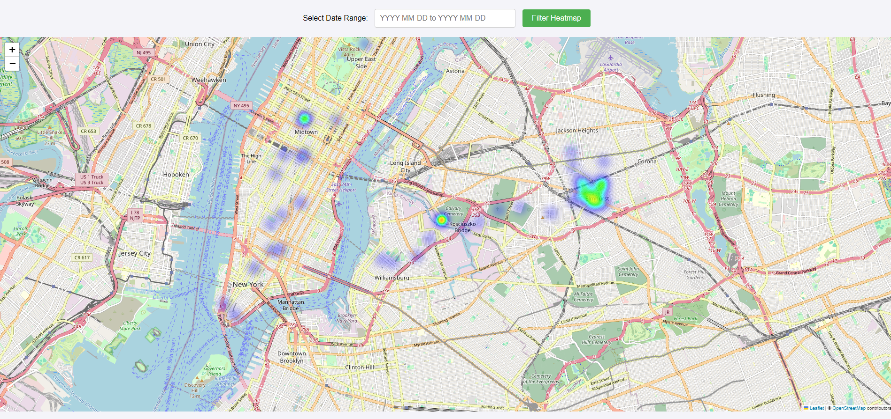

# Google Timeline Heatmap Visualizer

This project allows users to upload their Google Timeline Location History data (in JSON format) and generate a heatmap visualizing the locations they have visited over a specific date range.

## Motivation

I created this project because I wanted an easy way to visualize my own travel patterns using my Google Timeline data. As someone who loves to explore new places, I found it fascinating to look back at where I had been over time. However, the raw JSON data can be overwhelming to analyze. This project allows me to see my travels on a simple heatmap, making it much easier to reflect on my journeys.

For example, after uploading my Google Timeline data, I was able to see that I had visited certain cities more frequently during specific months. The heatmap showed concentrated areas of travel, which helped me realize how often I go to certain spots for work, leisure, or vacations. It made me appreciate how much I move around without always realizing it!

I wanted to share this tool with others so they can easily explore and reflect on their own travel data in a visual way.

## Features

-   **Upload Google Timeline Data**: Upload a `.json` file exported from your Google Timeline.
-   **Generate Heatmap**: Visualize your travels on a heatmap.
-   **Date Range Filter**: Filter the heatmap by specifying a custom date range.

## Example Screenshots

Here are some example screenshots of the application in action:
1. **Uploading Google Timeline Data:**
   - Screenshot of the upload page where users can select their `.json` file.
   

2. **Generated Heatmap:**
   - Screenshot of the heatmap generated after uploading the Google Timeline data, visualizing locations visited.
   

## Installation

1.  Clone the Repository:
    ```bash
    git clone https://github.com/seankql/google-timeline-heatmap.git
    cd google-timeline-heatmap
    ```
2.  Install Required Dependencies:
    ```bash
    sudo apt install python3
    sudo apt install python3-pip
    pip install flask
    pip install folium
    ```
3.  Run the Application:
    ```bash
    python3 app.py
    ```
4.  Open the application in your browser at `http://127.0.0.1:5000`.

## How to Use

1.  **Export Your Google Timeline Data**:
    -   Open Google Maps on your mobile device.
    -   Tap the profile icon in the top right corner.
    -   Select "Your Timeline" from the menu.
    -   Tap the three dots ("...") in the top right corner.
    -   Choose "Location & privacy settings."
    -   Select "Export Timeline data" and save the `.json` file.

2.  **Upload the Data**:
    -   Open the application in your browser.
    -   Upload the `.json` file containing your Google Timeline data.

3.  **Generate and Filter Heatmap**:
    -   After uploading, a heatmap will be generated to visualize your travel data.
    -   Optionally, apply a date range filter to view your travel data within a specific time period.

4.  **View and Interact with the Heatmap**:
    -   The heatmap is displayed in an interactive map within the browser.
    -   Use the date picker to filter the data by specific dates.

## Requirements

-   **Python** (3.6+)
-   **Flask** for the web framework
-   **Folium** for rendering maps

